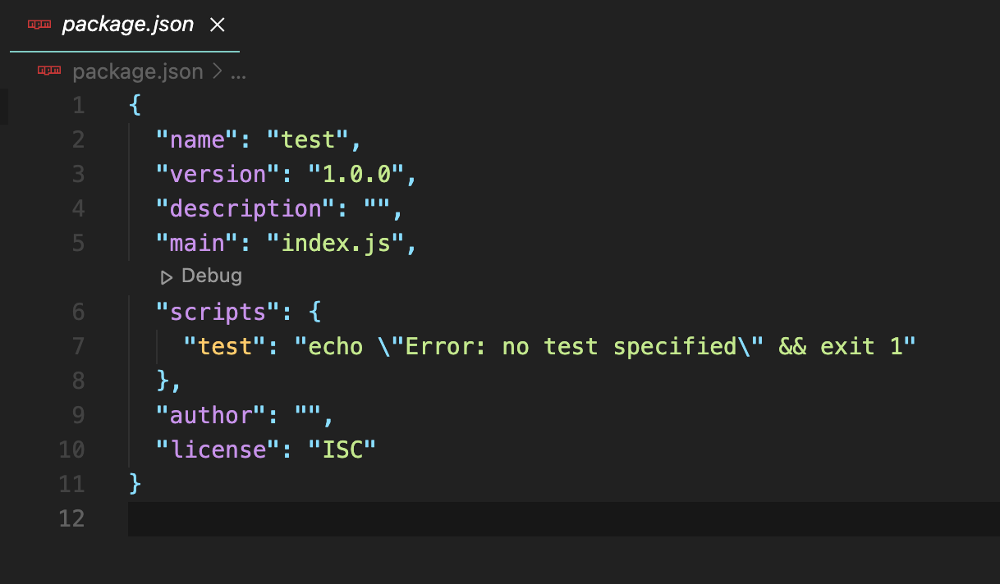
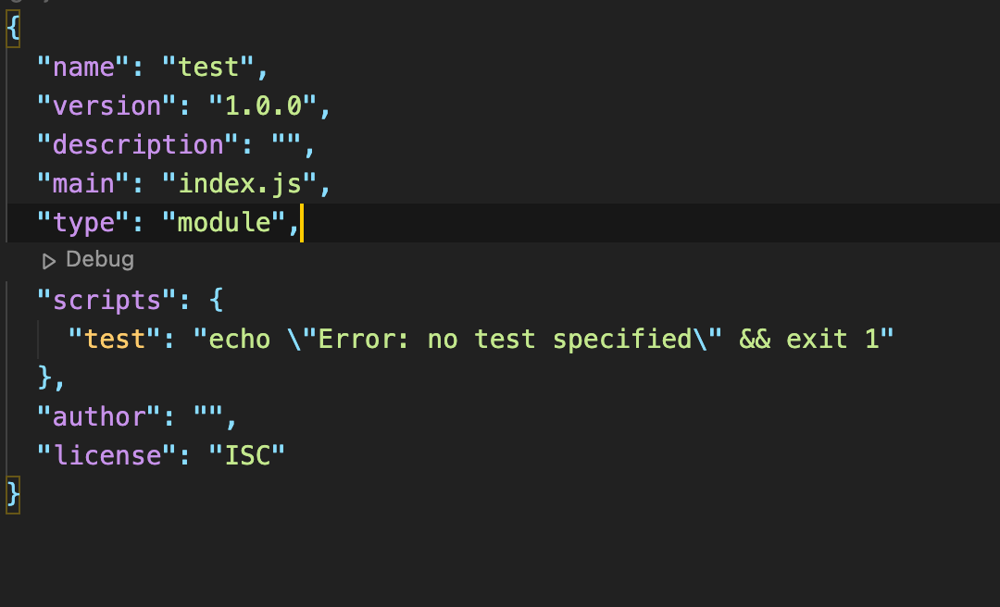
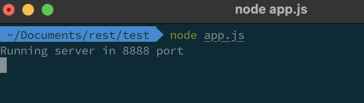
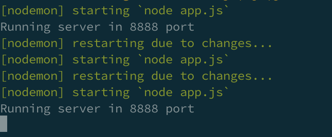

목차

1.  Package.json
2.  Install express
3.  server 만들기
4.  nodemon
5.  설정

## <span style="color: #F3C892">1. package.json</span>

<br>

```
    $ mkdir [폴더명]
    $ cd [폴더명]
    $ npm init
```

- package.json안에 들어갈 내용을 하나씩 물어본다. 수정을 나중에도 가능하므로 enter로 넘기다가 마지막 Is this OK? 에서 yse 누르면 내 프로젝트 폴더에 package.josn 파일이 있는 것을 확인할 수 있다.



- ES6에서 모듈에 대한 표준이 도입이 되었다. 이전에는 CommonJs에서 사용하는 require을 이용했다. 이제는 가독성이 좋고 비동식 방식으로 작동하고 메모리 측면에서 유리한 import export를 사용한다.
  이를 사용하기 위해서 package.json파일에서 아래처럼 추가해준다.

```javascript
"type": "module";
```



## <span style="color: #F3C892">2. Express install</span>

<br>

1. npm으로 시작

```
$ npm i express
```

2. yarn으로 시작

```
$ yarn add express
```

## <span style="color: #F3C892">3. Server 만들기</span>

node express.js는 3줄로 서버를 구축할 수 있을정도로 정말 간단합니다.

- 첫번째로 프로젝트 폴더에 app.js파일을 만들어 줍니다.

```
    $ touch app.js
```

- 간단하게 코드 작성해보기.

```JavaScript
    import express from 'express';

    const port = 8888;
    const app = express();

    app.get('/', (req, res, next) => {
        res.send('hello world');
    });

    // listen 2번째 인자로는 callback함수를 받습니다.
    app.listen(port, () => console.log(`Running server in ${port} port`));
```

- 터미널에서 프로젝트 폴더에서 node app.js실행해보면 잘돌아가는 것을 확인할 수 있다.



## <span style="color: #F3C892">4. Nodemon</span>

node app.js로 서버를 틀면 실시간으로 코드를 고치면 다시 서버를 다시 실행해야한다.
nodemon을 사용해서 새로운 변경사항을 서버에 적용시킬 수 있다.

- nodemon을 설치하기

```java
    // -g는 이 프로젝트 package에서 설치되는것이 아니라 global로 설치가 된다.
    // 다른 프로젝트에서도 nodemon 사용가능.
    $ npm install -g nodemon
```

- 터미널에서 실행하기

```
    $ nodemon app.js
```

여기서 res.send('hello world') -> res.send('Welcome!')으로 변경.



- 실시간으로 변경된 코드가 실행되는 것을 볼수 있다.

## <span style="color: #F3C892">5. 설정</span>

package.json파일에서 scripts에 추가해주기.

- 프로젝트가 커지면 nodemon app.js로 켜주는 것보다 npm, yarn을 이용해서 서버를 킬 수 있다. 프로젝트가 커지다보면 스타트파일을 못찾을 수 있기때문에 scripts을 작성해주는것이 좋다.

```javascript
    {
        "name": "test",
        "version": "1.0.0",
        "description": "",
        "main": "index.js",
        "type": "module",
        "scripts": {
            "test": "echo \"Error: no test specified\" && exit 1",
            "start": "nodemon app.js"

        },
        "author": "",
        "license": "ISC",
        "dependencies": {
            "express": "^4.17.2"
        }
    }

```
