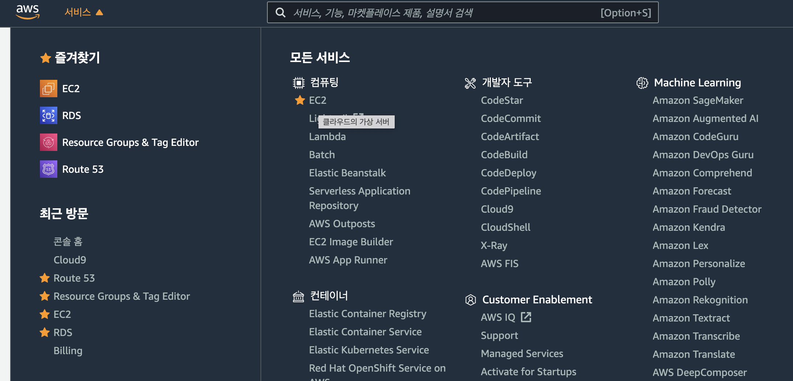
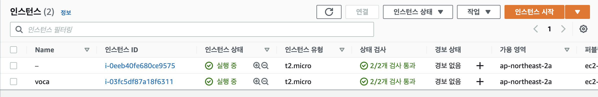
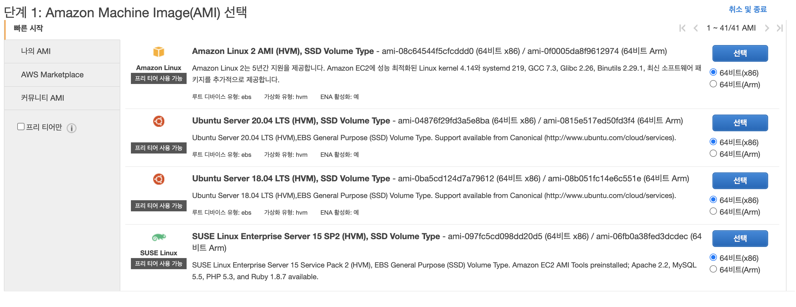
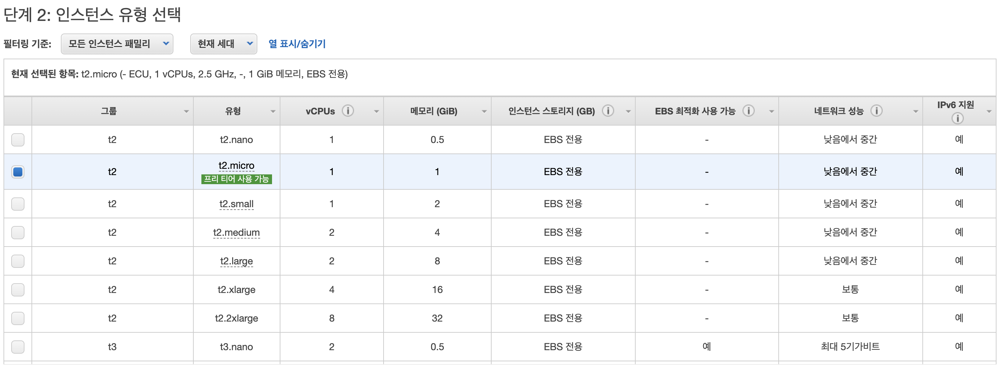
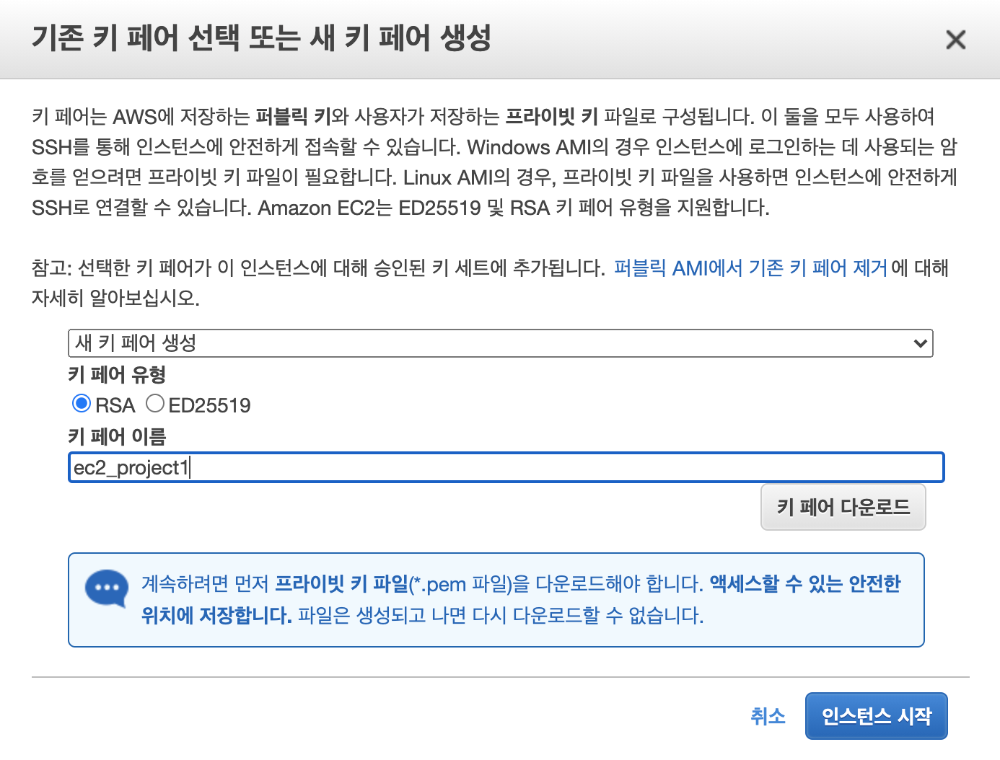
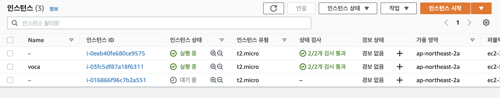
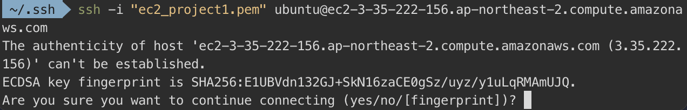
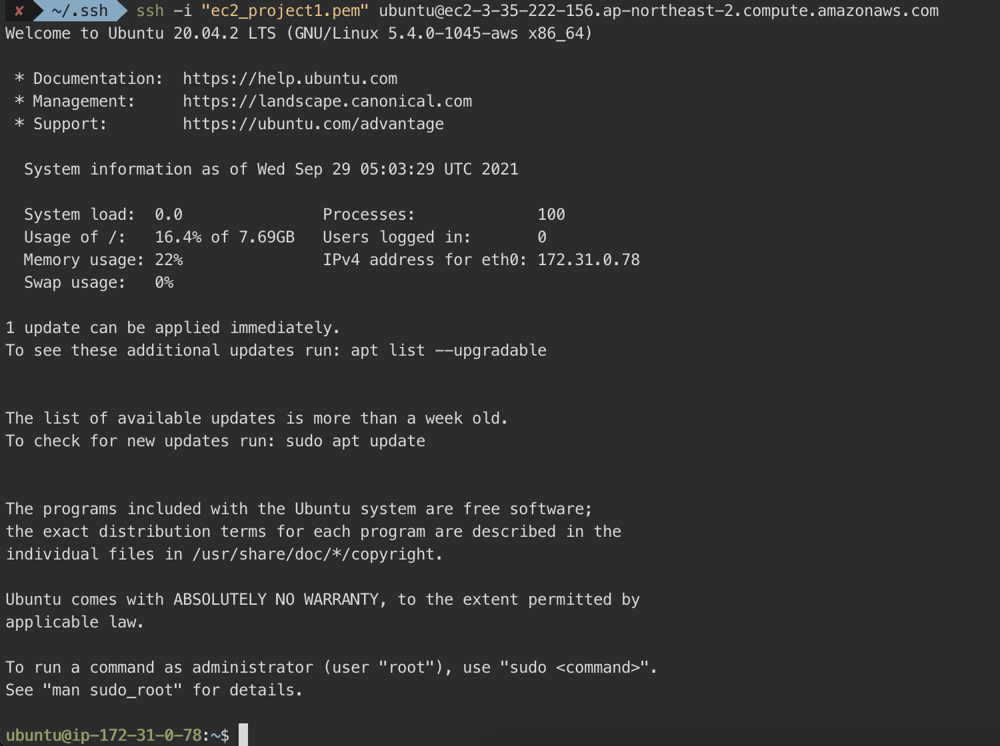

# AWS에서 EC2 인스턴스 생성후 Express 실행 해보기.

목차
1.  EC2 인스턴스 생성
2.  인스턴스 세팅
3.  Screend을 이용해서 express 서버 실행


## EC2 인스턴스 생성하기
<br>



- aws console 창에서 로그인한후에 Ec2 서비스에 들어간다.

<br>



- EC2에 들어갔다면 인스턴스 시작을 클릭한다.

<br>



- 많은 Server가 있지만 개인 프로젝트 하기에는 프리티어도 충분하기에 프리티어 Ubuntu Sever을 선택하는 것이 좋다.


<br>




- 여기서도 프리티어로 선택하고 시작한다.
- 인스턴스 시작 검토창에서는 바로 시작하기를 누른다.

<br>



- 시작 하기 버튼을 누른다.
- 첫번째 select바에서 새 키 페어 생성을 선택한다.
- 키페어 이름을 생성해준다 (띄어쓰기를 하면 터미널에서 오류가 날 수 있기때문에 underbar을 이용해서 이름을 작성한다). 

<br>



- 인스턴스 상태가 대기중이면 아직 생성중인 것이기 때문에 기다리면 실행중으로 변한다.
- 생성이 완료가 되면 내가 만든 인스턴스를 클릭하고 위에 연결 버튼을 클릭한다.

<br>


- 일단 생성한 키페어는 ssh 경로에 보관해서 관리하는것이 좋기 때문에 다운 받은 키를 ~/.ssh로 옮겨준다.

```
  mv ec2_project1.pem ~/.ssh
```

- ssh로 옮겼다면 키를 공개적으로 볼 수 없도록 해줍니다.
```
  chmod 400 ec2_project1.pem
```

- 인제 아래 코드를 복사해서 터미널에 입력해줍니다.
```
 ssh -i "ec2_project1.pem" ubuntu@ec2-3-35-222-156.ap-northeast-2 compute.amazonaws.com
```

<br>



- yes를 입력해줍니다.

<br>



- 그럼 만든 인스턴스가 잘돌아가는 것을 확인할 수 있습니다.


